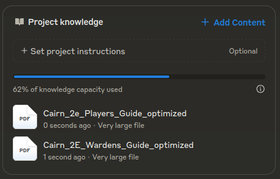

# Personnal Resources for Cairn

> [Cairn](https://cairnrpg.com/) is an adventure game about exploring a dark and mysterious Wood filled with strange folk, hidden treasure, and unspeakable monstrosities. Character generation is quick and random, adventures are tense and reward careful exploration, and combat is frantic and deadly. The game was written by [Yochai Gal](https://newschoolrevolution.com/).

## PDF Optimizer

This [tool](./tools/pdf-optimizer) was created to help reduce the size of the [Warden Guide 2nd Edition](https://cairnrpg.com/second-edition/wardens-guide/) PDF, making it suitable for use in [Claude](https://claude.ai) [projects](https://support.anthropic.com/en/articles/9519177-how-can-i-create-and-manage-projects).

## Resources

[Cairn Resources](https://cairnrpg.com/resources/) is an excellent starting point.

Here is the list that I mainly use and like.

### Virtual Table Top tools

- <https://kettlewright.com>, free, open-source application for managing characters and parties.
- [Pocket Cairn](https://brightsdays.github.io/pocket-cairn/), web app to manage a character.

### Generators

- [RogueCairn](https://www.kesiev.com/roguecairn/), opensource random generator of small worlds designed to be explored.
- [donjon](https://donjon.bin.sh), not specific to Cairn.

### Props

- [Cairn 2E tokens](https://drive.google.com/drive/folders/1f8pvf2gnRQ7rWxIrXvPGRRTBepXK8jIH)
